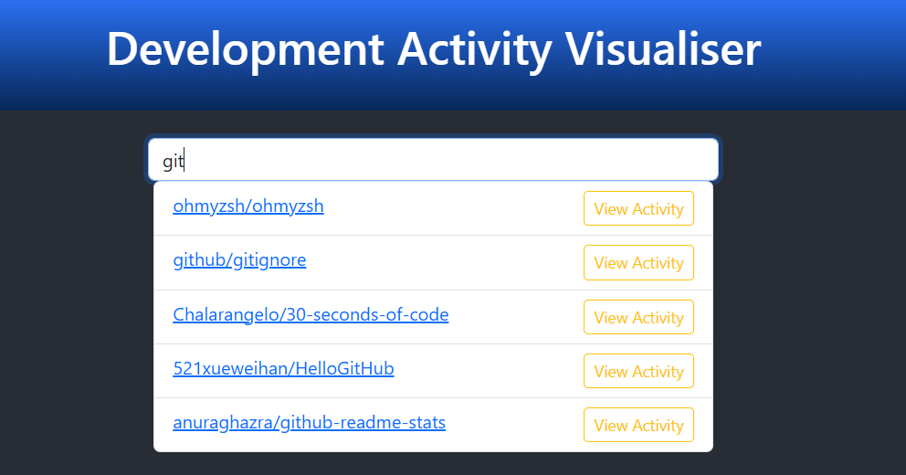

## Prerequisites

Requires Node JS (version >= 10.0.0) and NPM (version >= 6)

The backend (https://github.com/gavob/developer-activity-service) to be running for pulling GitHub data

## Install

From the command line/powershell in the `/development-activity-frontend` directory run `npm install` to install node modules

Run `npm start` to start the application

## Usage

Open the application in a browser http://localhost:3000/

Type the name of a public repository and select 'View Activity' to see an analysis of development activity for that repo

Use the search bar again to find and select another repository to change the analysis

The charts for releases, commits, comments, issues and pull requests simply display number of occurrences arranged by date. 
These can be affected negatively by very active public repositories because the 100 records fetched in the backend may
be reduced to just a few instances.

The charts for active contributors and issue types display the most prevalant recent issue labels and the most active
recent contributors

The charts for issue close times and pull request times shows the time in hours for the most recent pull requests to be merged and
the times issues take to be closed

## Improvements

Customising the charts proved to be quite difficult, I've used some other chart libraries before which were a bit simpler, but
the one I chose for this, Nivo, had some particularly nice looking charts. This features some in-depth options and controls 
to customise the charts, the existing code styling the charts used here needs further work and refactoring to generally tidy
up the code and things like styling tooltips on the charts needs a bit more work. Improving this really just requires learning the  
Nivo chart tools a bit deeper.

There is quite a long loading time after selecting a repository to see an analysis, improving this will largely come from 
some optimisation in the backend system (Which I do discuss briefly in the improvements here https://github.com/gavob/developer-activity-service). 

The analysis view itself could do with adjusted margins to line up elements a bit better and possibly some descriptions around some 
of the charts explaining the data displayed.

Further improvements to this could be combined data within charts, such as pull request and issue counts comparison. Deeper insights
around certain topics, which might be something like a button around issue times which allow you to view that particular issue
details in a modal view or drop down section within the analysis.